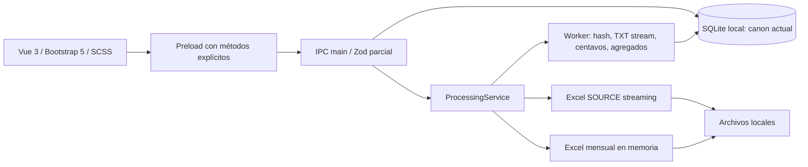
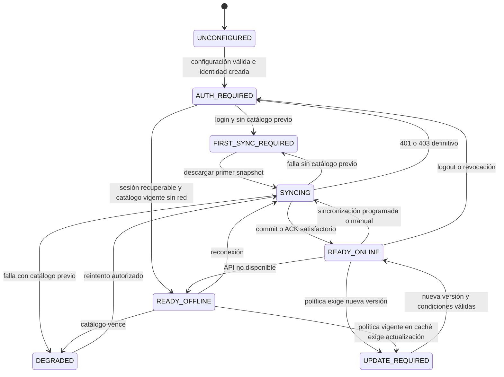
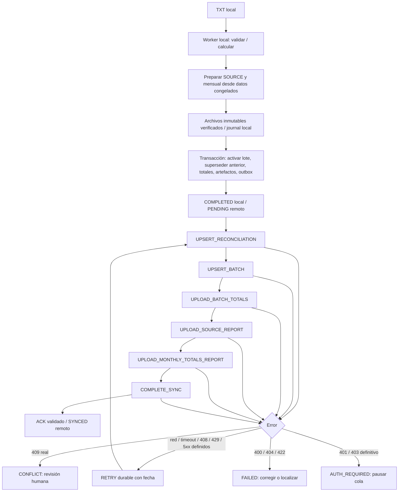
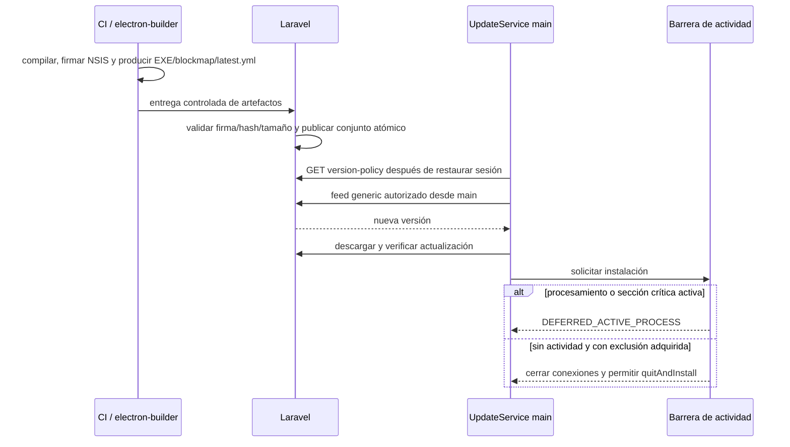

# SEFIPLAN Nómina Central — Fase 0

Estado: **auditoría y propuesta para revisión; no autoriza implementar la Fase 1**.

Fecha de referencia: 25 de agosto de 2026, America/Cancun. Revisión auditada: `3f77872d13a1422a49f898b080058b1dad5af226`. Árbol de trabajo inicialmente limpio. La aplicación declara `0.1.0`; Electron instalado es `37.10.3` (rango declarado `^37.2.6`).

## Alcance y entregables

Esta entrega solo agrega documentación. No cambia `src`, dependencias, migraciones ejecutadas, catálogos, bases del usuario ni instaladores. Las fases 1–6 necesitan revisión sucesiva. No hay API Laravel ni OpenAPI localizados en este repositorio: ningún contrato propuesto aquí se presenta como aprobado o probado contra Laravel.

| # | Entregable | Ubicación |
|---|---|---|
| 1 | Auditoría de arquitectura | Sección 1 de este documento |
| 2 | Mapa de componentes afectados | Sección 2 |
| 3 | Diagrama de estados de inicio | Sección 3 |
| 4 | Diagrama de sincronización entrante | Sección 4 |
| 5 | Diagrama de outbox saliente | Sección 5 |
| 6 | Propuesta exacta de migraciones | [Migraciones SQLite](migraciones-sqlite.md) |
| 7 | Contrato API esperado | [Contrato y pendientes](contrato-api.md) |
| 8 | Estrategia legacy | Sección 6 |
| 9 | Almacenamiento seguro de token | Sección 7 |
| 10 | Flujo de actualización | Sección 8 |
| 11 | Errores y reintentos | Sección 9 |
| 12 | Plan de pruebas | [Verificación y pruebas](verificacion.md) |
| 13 | Riesgos y decisiones pendientes | Sección 11 |

El diseño de cada vista y sus estados se encuentra en [Interfaz y operación](interfaz.md).

## 1. Auditoría de la arquitectura actual

### 1.1 Lectura realizada

Se leyeron completos `AGENTS.md`, `package.json`, `DatabaseService.ts`, `MigrationService.ts`, `migrations.ts`, `ProcessingService.ts`, `PayrollProcessingWorker.ts`, `registerIpcHandlers.ts`, `preload.ts`, `shared/schemas/ipc.ts`, ambos archivos de tipos solicitados, router, las nueve vistas y las 16 suites unitarias existentes. También se revisaron los tres scripts de pruebas/fixture, bootstrap main/window, recuperación, respaldos, reportes SOURCE/mensual, matcher, preflight, shell, selector de conceptos y adaptador de preview.

No se abrió una base de datos operativa ni se ejecutó la ruta de recreación de datos. La auditoría funcional de UI es de código; no equivale a una revisión visual o de lector de pantalla.

### 1.2 Flujo existente



SQLite usa WAL, llaves foráneas y `busy_timeout=5000`. Los IDs enteros locales enlazan expedientes, lotes y catálogos. El worker conserva agregados, snapshots y retenidos, no una tabla con cada movimiento. El parser y los cálculos en centavos deben mantenerse.

### 1.3 Hallazgos y consecuencias

Las referencias son a archivos bajo `src/`, salvo indicación contraria.

| Prioridad | Evidencia actual | Consecuencia para la integración |
|---|---|---|
| Crítica | `main/database/DatabaseService.ts:145` ejecuta `seed()` en cada constructor; `:181` sobrescribe nombres por código | Abrir consultas, worker o respaldo puede reintroducir datos o deshacer el canon. Retirar la invocación productiva en Fase 2, conservando fixtures de migración |
| Crítica | `main/ipc/registerIpcHandlers.ts:70–79` publica escrituras de grupos, conceptos, alias y tipos | Retirar handlers de escritura y métodos preload; ocultar botones no es suficiente |
| Crítica | `renderer/views/ImportView.vue` contiene `saveQuickConcept`; `ConceptMultiSelect.vue` emite `create` | También eliminar el alta rápida y sustituirla por diagnóstico/backoffice |
| Alta | `PayrollProcessingWorker.ts:65–76` lee reglas y conceptos antes de la transacción que guarda snapshots | Las lecturas pueden pertenecer a revisiones distintas. Capturar revisión, reglas, conceptos y alias en una sola transacción corta; evaluar desde esa captura |
| Crítica | `ProcessingService.ts:60–65` confirma lote y reemplazo antes de generar el mensual, con compensación posterior | Una outbox que observe `COMPLETED` podría enviar un resultado aún reversible. Diseñar finalización local y outbox como un único commit tras preparar reportes |
| Alta | `MonthlyReportBuilder.ts:44–52` sobrescribe ruta y fila vigente; índices de `report_artifacts` admiten un reporte por tipo/propietario | Una operación pendiente puede perder los bytes originales al regenerar el mes. Versionar artefactos y conservar spool inmutable hasta confirmación remota |
| Alta | Reportes consultan códigos/nombres vivos de grupo/tipo; snapshots actuales no congelan tipo de nómina | Una sincronización puede cambiar etiquetas o rutas durante una exportación. Capturar también identidad/nombres de grupo y tipo |
| Alta | No hay identidad, sesión, cliente HTTP, outbox, vigencia ni política de versión | Nuevas capas deben entrar en main, con autorización previa a nuevas operaciones |
| Alta | Handlers ignoran `event.sender`/`senderFrame`; varios IDs se convierten con `Number`/`String` y settings no usa Zod | Validar emisor y esquema en todos los canales antes de operar; incorporar esa protección desde Fase 1 |
| Alta | `window.ts` permite `VITE_DEV_SERVER_URL` sin comprobar `app.isPackaged`; no bloquea nuevas ventanas/navegación | En paquete cargar solo contenido local; rechazar ventanas y navegación externas; backoffice con allowlist HTTPS |
| Alta | Restauración IPC copia el `.sqlite` vivo para respaldo previo, elimina WAL/SHM y reemplaza archivo sin coordinación | Necesita barrera de mantenimiento, backup consistente y cierre de conexiones; preservar identidad y outbox posterior al backup |
| Alta | `main.ts` ofrece recrear esquema incompatible en desarrollo y recomienda reiniciar datos en paquete | No reutilizar ese camino en la transición; ante incompatibilidad preservar todo, generar diagnóstico y pedir migración asistida |
| Media | `hasActiveProcesses()` solo consulta un mapa de workers y nadie lo usa como barrera de cierre | El mapa permanece durante los Excel del proceso, pero no cubre restauración, transacciones ni uploads; crear registro explícito de actividad crítica |
| Media | `listCatalog` carga todos los alias y filtra por cada concepto; catálogo/docs filtran todo en renderer | Consultas paginadas e índices; no repetir un barrido completo por cada fila |
| Media | Consolidado y matriz anual consultan solo la primera página de 100 expedientes | Con más grupos pueden mostrar totales incompletos. Agregaciones SQL dedicadas, no sumar una página |
| Media | SOURCE es streaming con `useSharedStrings=true`; mensual usa `Workbook` y consultas `.all()` | No afirmar memoria constante: cardinalidad de cadenas/agregados importa. Medir SOURCE y mensual por separado |
| Media | `ExcelReportBuilder` elimina archivos de otros layouts con prefijo coincidente | No eliminar archivos referenciados por outbox/reportes históricos |
| Media | `AuditService` acepta metadata arbitraria; no hay logs rotativos | Añadir logger por lista permitida; no serializar errores HTTP ni payloads completos |
| Media | `schema.test.ts` exige exactamente una migración; `payroll-types.test.ts` importa seeder productivo | Actualizar esas pruebas al introducir incrementales; preservar verificación del esquema v1 como fixture |
| Media | Script de integración replica parte de `ProcessingService` | No cubre toda la compensación real ni IPC. Ampliar integración del servicio real y pruebas de caída |

### 1.4 Seguridad y límites observados

Se conservan `contextIsolation=true`, `nodeIntegration=false`, `sandbox=true`, `webSecurity=true`, preload limitado y tokens opacos para archivos elegidos por diálogo. Los tokens de archivos actuales **no son tokens de autenticación**.

La CSP existe, pero incluye localhost/WebSocket de desarrollo en el mismo HTML; separar política productiva. No se localizaron llamadas de red en el worker actual. No hay `electron-updater` entre dependencias ni `publish` en builder. Windows ya usa NSIS x64 y `asar`.

SOURCE contiene nombres y los datos convertidos del TXT, incluyendo líneas incompatibles. **No subir TXT no significa anonimizar la información**: acceso, retención y autorización de los Excel deben aprobarse institucionalmente. No exportar ese contenido en diagnósticos.

## 2. Mapa de componentes afectados

Los archivos nuevos de esta tabla son propuestas; no existen como implementación de esta entrega.

| Fase | Archivos existentes a modificar | Archivos/capas propuestos | Cambio acotado |
|---|---|---|---|
| 1 | main/main, main/window, database/migrations, IPC, preload, tipos/schemas, router/App | `main/services/central/{ApiClient,AuthService,SecureTokenStore,DeviceService}.ts`, `main/config/central.ts`, `shared/schemas/central.ts`, `shared/domain/centralState.ts`, `renderer/stores/central.ts`, LoginView | Identidad, configuración administrada, sesión, DTO seguro y guardas IPC |
| 2 | DatabaseService, MigrationService, ConceptMatcher, PreflightService, worker, ProcessingService, catálogo, selector, ImportView, SettingsView | `CatalogSyncService`, repositorio SQLite de catálogo, contratos/fixtures aprobados | UUID, transacción de catálogo, snapshots consistentes, fin de CRUD/seeding |
| 3 | migrations, ProcessingService, RecoveryService, IPC/preload, AppSidebar/router | `SyncOutboxService`, `ConnectivityService`, `SyncOrchestrator`, repositorio outbox, SyncView | Cola durable, estado local/remoto, reintentos y consulta paginada |
| 4 | ProcessingService, ambos builders, ReportPathService, migrations, historial | `ReportUploadService`, mapper de resultados, journal de finalización y spool | Resultados y reportes inmutables, progreso, relocalización verificada |
| 5 | package/lock, main/window, SettingsView, App | `UpdateService`, componente UpdateStatus | Feed autenticado, firma, política y barrera de instalación |
| 6 | BackupService, RecoveryService, IPC, docs operativos y pruebas | logger rotativo sanitizado, exportador de diagnóstico | Restauración coordinada, límites, recuperación, accesibilidad y rendimiento |

Dependencia de fases: Fase 3 puede guardar intenciones pendientes sin despacharlas. **La publicación saliente no se activa hasta completar en Fase 4 la finalización atómica y la preservación de archivos**. Las garantías de IPC/token no esperan a Fase 6.

| Servicio main | Responsabilidad y dependencia | Exclusiones |
|---|---|---|
| ApiClient | HTTPS, timeout/abort, tamaño máximo, Zod, errores tipados, bearer del proveedor de token | UI, SQL y reintentos de negocio |
| AuthService | Login/restore/logout/revocación; serialización de cambios de sesión | DTO de token al renderer |
| SecureTokenStore | Cifrado SO, escritura atómica de `secure/session.bin` | SQLite, localStorage, fallback en claro |
| DeviceService | UUID de instalación persistido, asociación al dispositivo y heartbeat | Identificadores de hardware invasivos |
| CatalogSyncService | Manifest/snapshot, checksum, transacción y conflictos | HTTP dentro de transacción o worker |
| SyncOutboxService | Intenciones inmutables, dependencias, claim, reintentos y ACK | Recalcular payload en cada intento |
| ReportUploadService | Archivo inmutable, stream con backpressure, progreso, cancelación | `readFile` del Excel o del TXT |
| ConnectivityService | Petición real, disponibilidad y latencia | Usar `navigator.onLine` como autoridad |
| UpdateService | Política, feed, descarga, firma e instalación segura | Instalar desde renderer o omitir firma |
| SyncOrchestrator | Un ciclo de catálogo y uno de salida; exclusión de secciones críticas | Bloquear el procesamiento durante peticiones de red |

## 3. Estado derivado de inicio y operación

Propuesta: función pura compartida `deriveCentralState(facts, now)`; main decide permisos y Pinia/composable los representa con `computed`. No duplicar reglas en vistas. Main revalida inmediatamente al aceptar `payroll:process-month` y otras escrituras.

Hechos: configuración válida, identidad, token disponible, expiración/revocación conocida, conectividad, revisión/checksum válido, vigencia, errores, actividad de sincronización, política de versión y actividad local. DTO: `state`, `canStartProcessing`, `canReadHistory`, `canSync`, `canInstall`, `blockingReasons`, `catalogExpiresAt`, `pendingCount`, `updateStatus`; nunca credenciales.

Precedencia propuesta (primera condición aplicable):

| Orden | Condición | Estado | Nuevo procesamiento |
|---|---|---|---|
| 1 | URL/identidad ausente o inválida | UNCONFIGURED | No |
| 2 | Token ausente, expirado o revocado conocido | AUTH_REQUIRED | No |
| 3 | Política vigente exige bloqueo por versión mínima | UPDATE_REQUIRED | No; terminar lo ya aceptado |
| 4 | Nunca se confirmó snapshot íntegro | FIRST_SYNC_REQUIRED | No |
| 5 | Catálogo vencido, requiere verificación tras restaurar o error operativo | DEGRADED | Solo si catálogo válido y no hay otro bloqueo |
| 6 | Ciclo de sincronización activo | SYNCING | Sí con catálogo válido; esperar únicamente captura/commit corto |
| 7 | API disponible | READY_ONLINE | Sí |
| 8 | API no disponible y catálogo válido | READY_OFFLINE | Sí; salida pendiente |

`DEGRADED` por catálogo vencido lleva motivo `CATALOG_EXPIRED`, no un noveno estado improvisado. Los errores remotos no alteran `localStatus`. Errores y disponibilidad continúan visibles como hechos aunque un estado de mayor prioridad domine. Política obligatoria y acciones de actualización permanecen visibles incluso en AUTH_REQUIRED.



El diagrama ilustra recorridos; la tabla de precedencia gobierna todas las combinaciones. Login con catálogo previo puede derivar directamente READY_ONLINE/READY_OFFLINE/DEGRADED. Sin conexión no se puede detectar una revocación nueva: solo se admite la última sesión conocida dentro de su política offline. No inventar refresh tokens si el contrato no los contempla.

Vigencia: `expiresAt = min(validUntil, syncedAt + maximumOfflineAgeSeconds)` usando únicamente límites presentes y el límite institucional como fallback/techo aprobado. Falta definir unidades y precedencia exactas con Laravel. Con `now >= expiresAt` bloquear nuevos lotes incluso si la red figura disponible. Un 304 actualiza `last_attempt_at`, **no prolonga automáticamente** `synced_at` ni `valid_until`; la renovación exige política/headers explícitos. Detectar retrocesos importantes del reloj y solicitar verificación. Advertir con umbral configurable antes del vencimiento.

## 4. Sincronización entrante

```mermaid
sequenceDiagram
  participant O as SyncOrchestrator
  participant A as ApiClient / Laravel
  participant C as CatalogSyncService
  participant D as SQLite
  participant U as Renderer
  O->>C: single-flight de catálogo
  C->>D: guardar last_attempt_at
  C->>A: GET manifest / If-None-Match
  alt 304
    A-->>C: sin cambios
    C-->>U: intento actualizado; vigencia no renovada implícitamente
  else revisión nueva
    C->>A: snapshot consistente con revisión del manifest
    A-->>C: snapshot versionado
    C->>C: Zod, referencias, serialización canónica y SHA-256
    C->>D: backup consistente antes del primer enlace legacy
    C->>D: BEGIN IMMEDIATE corto
    C->>D: enlazar/upsert UUID, resolver FKs, inactivos y conflictos
    C->>D: revisión/checksum/política
    alt todo válido
      C->>D: COMMIT
      C-->>U: catalog/statusChanged
    else colisión o error
      C->>D: ROLLBACK
      C->>D: diagnóstico sanitizado en transacción aparte
      C-->>U: catálogo anterior conservado
    end
  end
```

Descargar y validar fuera de SQLite; comprobar revisión/schema/tenant y existencia de cada UUID referenciado antes del upsert. Manifest y snapshot deben referirse a la misma revisión; si cambia entre solicitudes, volver a consultar con límite, no aceptar combinación inconsistente. La semántica de tombstones/snapshot completo requiere contrato aprobado.

El primer enlace por código es una reconciliación legacy única, no la identidad futura. Una vez asignado `central_uuid`, solo buscar por UUID; un mismo código con UUID distinto es conflicto, no reasignación.

Para iniciar un lote, reservar una sección corta que capture revisión, snapshots de conceptos/alias y metadatos de grupo/tipo de modo coherente. El worker construye sus reglas **desde los snapshots**, no relee el catálogo vivo. No sostener locks durante lectura TXT ni Excel. Si la revisión cambió desde el preflight, revalidar selección/metadatos antes de aceptar y pedir confirmación si afectó reglas.

## 5. Outbox y finalización local



La flecha de RETRY vuelve al planificador; este ejecuta **solo la operación fallida**, nunca repite innecesariamente toda la cadena. La cadena se serializa por expediente/revisión; expedientes independientes pueden progresar con concurrencia limitada. La descarga de catálogo tiene su propio single-flight; no esperar red bajo mutex de SQLite.

### 5.1 Punto de commit y caídas

No basta insertar outbox después de enviar `payroll:completed`. Se necesita:

1. Reservar `completion_uuid` y revisión objetivo en journal durable; candidato todavía no activo. Registrar intención antes de producir archivos.
2. Construir SOURCE y mensual de la revisión candidata usando snapshots y conjunto de lotes proyectado. El builder actual deberá aceptar ese conjunto, sin activar primero el candidato.
3. Guardar ambos archivos en spool inmutable, verificar hash/tamaño y cerrar streams. No sobrescribir aún la copia mensual visible. Journal pasa a `FILES_READY`.
4. En una transacción corta confirmar que la revisión base sigue vigente, activar/sustituir, registrar artefactos/versiones, actualizar expediente e insertar las seis operaciones y dependencias. Marcar journal `COMMITTED`. Si falla SQLite no hay éxito local ni despacho remoto.
5. Publicar copia de conveniencia en la ruta mensual actual. Si falla esa copia pero existe spool confirmado, advertir y permitir abrir el artefacto inmutable; no convertir un fallo de red en fallo de proceso.
6. Emitir “Procesamiento completado. Sincronización pendiente.” solo después del commit. Reinicio recupera journal; un `COMMITTED` ya contiene sus operaciones. Un `FILES_READY` debe verificar base/hash y finalizar o conservar candidato para recuperación, nunca adivinar que se sincronizó.

SQLite y filesystem no comparten transacción: el journal y la inmutabilidad cierran esa brecha, no se promete atomicidad ficticia entre ambos. Cada archivo completado de una importación múltiple conserva su resultado aunque falle el siguiente.

### 5.2 Identidad e idempotencia

Generar `operationUuid` una sola vez; congelar payload y hash deterministas. Reclamar trabajo mediante actualización condicional en transacción, no mantener `IN_PROGRESS` durante una transacción abierta. Guardar respuesta validada/mapeo UUID/estado SYNCED en el mismo commit. UUID central conocido nunca cambia.

Una dependencia aún sin UUID remoto plantea una decisión de contrato: se propone referenciar el `operationUuid` predecesor en el payload inmutable, para que Laravel resuelva la entidad. Si Laravel no soporta eso, debe aprobar UUID de entidad reservado por cliente o materialización diferida explícita. **No parchear `payload_json` tras el primer envío ni inventar IDs centrales. Bloquea activar la Fase 4.**

Una respuesta perdida se recupera reenviando la misma operación/hash; Laravel debe devolver el mismo ACK. Una misma clave con hash distinto debe ser conflicto. El servidor debe retener idempotencia al menos tanto como el período de reintentos/restauración permitido. Nuevos contenidos implican nueva operación y vínculo `supersedes_operation_uuid`; no mutar la anterior ni su archivo.

Al arrancar, reclamar `IN_PROGRESS` abandonados como RETRY solo tras confirmar instancia exclusiva y ausencia de lease vivo. `FAILED`/`CONFLICT` no se reintentan automáticamente; reanudar autenticación no los convierte indiscriminadamente en PENDING.

### 5.3 Upload

Registrar reporte, persistir reportUuid, transmitir multipart con stream/backpressure, comprobar tamaño y SHA-256 confirmado por servidor y consultar disponibilidad/ACK. El registro debe ser idempotente usando una identidad estable de subpaso derivada de la operación, según contrato. Un reporte ya disponible con mismo UUID/hash/tamaño se confirma sin reenviar bytes.

Progreso distingue bytes transferidos de verificación remota; 100 % transferido no significa SYNCED. Cancelar aborta stream/request y deja estado durable recuperable. Nunca leer el Excel completo con `readFile`. URL de upload se limita al origen HTTPS aprobado; no propagar bearer a redirects/orígenes no autorizados. Preparar interfaz de transporte sustituible por carga por partes, sin prometer reanudación hasta que la API la defina.

Si falta archivo: `FAILED/MISSING_LOCAL_FILE`, mostrar ruta solo en UI local. Relocalizar con diálogo que produce token opaco y verificar hash/tamaño contra artefacto; hash distinto exige nuevo contenido, no reintento. No aceptar rutas libres del renderer.

## 6. Transición legacy y recuperación

Antes de primera sincronización: inventario y backup mediante API de backup de SQLite, verificación de integridad, espacio libre, manifiesto de esquema/revisión y ruta registrada localmente. No copiar únicamente un `.sqlite` vivo con WAL.

Orden de enlace: grupos por `code`, conceptos por `code`, alias por `normalized_description`, tipos por `code`. Exigir coincidencia única y ausencia de UUID previo distinto. Alias inactivos pueden duplicar descripción hoy: nunca elegir el primero. Verificar el concepto padre por UUID; registrar discrepancia de asociación antes de aplicar el canon cuando el enlace es inequívoco.

Canon prevalece en nombre/código/estado/factor/asociación; no ejecutar `canonicalConceptName` para modificar el nombre oficial recibido. La normalización del matcher debe versionarse con Laravel. Guardar cambios relevantes y conflictos de modo sanitizado.

Sin equivalencia: conservar fila y referencias históricas, marcar `LEGACY_UNMAPPED`, excluir de nuevos procesamientos mediante `active AND central_uuid IS NOT NULL AND mapping_status='MAPPED'`. La consulta histórica no depende de que el catálogo siga activo. Si luego aparece el elemento, solo enlazar automáticamente con equivalencia inequívoca de una fila nunca mapeada; de otro modo exigir resolución institucional con UUID explícito. No subirlo como catálogo.

Código y `sort_order` son únicos hoy. Para intercambios entre filas ya mapeadas, utilizar valores temporales reservados sin colisión dentro de la transacción y después los valores canónicos. Un código ocupado por otra identidad no implicada es conflicto y rollback; no borrar ni renombrar silenciosamente legacy. El orden de nómina para filas legacy se reubica fuera del rango central preservando su orden relativo, con diagnóstico; esta política necesita revisión.

Los lotes históricos no tienen `catalog_revision`. Mantenerla null como procedencia legacy; no adjudicarles retroactivamente la primera revisión descargada. Tampoco reescribir nombres/factores históricos. Su envío requiere procedimiento explícito aprobado, no backfill automático de outbox.

Antes de aplicar el primer canon, conservar en diagnóstico/respaldo las etiquetas locales de grupos y tipos que usan lotes antiguos. No presentarlas como fotografías originales si nunca se capturaron: distinguir “etiqueta al migrar” de “snapshot del procesamiento”. Si un mensual nuevo incluye lotes históricos sin UUID/procedencia remota, el proceso local puede completarse, pero su cadena saliente queda bloqueada con `LEGACY_DEPENDENCY_UNMAPPED` hasta reconciliación institucional. No fabricar UUID ni enviar un mensual parcial como completo.

Restauración propuesta:

1. Barrera de mantenimiento: detener despacho y nuevas operaciones, esperar workers/Excel/transacciones/confirmaciones; backup consistente de estado actual.
2. Extraer solo entradas permitidas, limitar tamaño/descompresión, validar manifiesto, esquema compatible, `integrity_check` y FKs en candidato aislado, sin seeders.
3. Conservar installationUuid del equipo. Comparar identidad y ámbito institucional del backup; otra instalación exige confirmación y procedimiento de reconciliación, no clonar identidad.
4. No incluir/restaurar `secure/session.bin`. Invalidar sesión si cambia la vinculación de usuario/ámbito; exigir login para reanudar cuando proceda.
5. Restaurar outbox con sus operationUuid/hash. No perder operaciones creadas después del backup: preservarlas con sus entidades/archivos y reconciliar en candidato o bloquear restauración si no se puede; no insertar una outbox huérfana.
6. Marcar catálogo `requires_verification=1`; reconsultar manifest con red. Comparar ACK remoto para operaciones restauradas; no inferir que un archivo es remoto por existir localmente.
7. Detectar archivos faltantes y exponer diagnóstico; reemplazar base solo con conexiones cerradas y estrategia de recuperación si se interrumpe el reemplazo.

El backup actual incluye SQLite, **no los Excel**. UI y documentación deben distinguir respaldo local, respaldo central, reporte local y reporte sincronizado. Definir retención/copia del spool antes de activar uploads.

## 7. Configuración, identidad y token

Configuración main: `apiBaseUrl`, `backofficeUrl`, `updateChannel`, `requestTimeoutMs`, `catalogMaximumOfflineAge` y `syncRetryPolicy`. Validar unidades, rangos, esquema y origen al arrancar. Producción recibe valores de build main o archivo administrado validado; no campos editables ni overrides arbitrarios de entorno. Desarrollo puede usar loopback HTTP con opt-in exclusivo de modo no empaquetado. Ningún secreto en `VITE_*`.

HTTPS/TLS obligatorio en producción: no `rejectUnauthorized=false`, callbacks que acepten certificados ni `NODE_TLS_REJECT_UNAUTHORIZED=0`. Documentar CA institucional en Windows y comprobar si el transporte Node/Electron elegido utiliza el almacén previsto; no asumir equivalencia de trust stores. Política de redirects explícita sin fuga de Authorization. No cambiar servidor con outbox pendiente de otro ámbito.

`DeviceService` crea `randomUUID()` una vez en transacción singleton; persiste nombre, UUID remoto y fechas. Login vincula instalación/dispositivo sin usar MAC/serial/Machine GUID. Heartbeat envía deviceUuid/installationUuid/appVersion/platform y actualiza lastSeen; 403 revocado elimina sesión conservando datos.

`SecureTokenStore`: después de `app.whenReady()`, verificar cifrado disponible, cifrar, escribir archivo temporal bajo `userData/secure`, cerrar y reemplazar `session.bin` atómicamente. Aplicar ACL apropiada al usuario Windows; no confundir `mode=0600` con una ACL Windows. Archivo solo cifrado; nunca backup de token.

En los tipos instalados de Electron 37.10.3, `SafeStorage` contiene `encryptString`/`decryptString`, no variantes async. Usar temporalmente adaptador de API compatible con I/O asíncrono y cifrado corto síncrono; no llamar métodos ausentes mediante casts. Tras actualizar Electron, probar migración del blob y API async con sus tipos/errores reales. La documentación actual recomienda la variante async y describe DPAPI en Windows; protege frente a otros usuarios, no frente a software malicioso bajo la misma cuenta. [safeStorage oficial](https://www.electronjs.org/docs/latest/api/safe-storage).

Auth main llama al endpoint de login; renderer recibe solo userName/deviceUuid/deviceName/abilities/authenticated. Limpiar campo contraseña y referencias tras respuesta; JavaScript no garantiza borrado físico de strings. Nunca loguear request/response de login. Restaurar token cifrado no equivale a confirmar vigencia contra servidor: estado de sesión conocida y expiración deben distinguirse.

Logout: pausar orquestador, abortar peticiones, usar generación de sesión para descartar respuestas tardías, intentar revocar con timeout y borrar token local en `finally` aunque la API falle. Si falla borrado local, bloquear restauración de esa sesión y mostrar error accionable, no declarar logout seguro. Limpiar headers del updater y proveedores de token; preservar outbox. No guardar credenciales para reintentar login.

IPC: validar main frame, webContents esperado y URL local exacta (origen dev permitido solo en dev). Schema Zod incluso para IDs, queries, acciones vacías y settings; errores DTO por lista permitida. Eventos devuelven función unsubscribe. Prohibidos canales arbitrarios y filesystem/API/updater públicos. El backoffice se abre con `shell.openExternal` tras resolver una ruta permitida localmente; rechazar credenciales en URL, protocolos ajenos y redirecciones construidas desde texto remoto. [Guía oficial de seguridad Electron](https://www.electronjs.org/docs/latest/tutorial/security).

## 8. Actualización segura



Fijar versión compatible de `electron-updater` y lock en Fase 5; no depender de nombres de opciones de documentación más nueva sin comprobar tipos. Conservar NSIS, `appId`, directorio de datos, identidad del editor y estrategia de firma. `publish: generic` contiene URL pública de configuración, **nunca headers secretos de build**. Authorization se obtiene en main al consultar/descargar y se elimina en logout.

La documentación de builder confirma generación/publicación de metadatos y entrega manual para proveedor generic; Laravel recibe y publica artefactos, no compila. Validar rangos HTTP y headers en EXE/blockmap además del YAML. [Publicación oficial](https://www.electron.build/publish/).

Comparar versiones con SemVer, no lexicográficamente. Política cacheada con fecha/vigencia y canal; versión inferior a minimumSupportedVersion bloquea solo según política central. `mandatory` y su relación con versión mínima deben acordarse; un booleano de descarga no interrumpe un lote.

Estados de actualización independientes del estado de app: IDLE, CHECKING, AVAILABLE, DOWNLOADING, DOWNLOADED, DEFERRED_ACTIVE_PROCESS, INSTALLING, NOT_AVAILABLE, ERROR, REQUIRED. Mantener `required` como hecho aunque el estado visible sea DOWNLOADING. Consultar al iniciar después de auth, manualmente y con intervalo institucional moderado/jitter; dev desactivado salvo fixture explícita.

La barrera debe cubrir procesos completos (incluidos Excel), transacciones, restauración/migración y confirmación crítica de upload. Adquirir exclusión y bloquear inicios antes de comprobar contadores evita una carrera check-then-install. Cierre de ventana y “Instalar al cerrar” pasan por la misma barrera. No activar instalación automática al salir por defecto; la API exacta para desactivarla se verifica en la versión fijada. Una intención pospuesta puede ejecutarse cuando termine la actividad, avisando al usuario y revalidando condiciones. Manejar cierre de sesión/apagado Windows sin iniciar una instalación insegura. [Actualización oficial](https://www.electron.build/docs/features/auto-update/).

No deshabilitar verificación Authenticode; configurar editor y firma del pipeline. Hash de descarga y firma son comprobaciones diferentes. Probar actualización real firmada N-1→N en VM Windows, migración/backup y reinicio, no solo `npm run dev`. La 0.1.0 actual carece de updater: requiere instalación inicial del cliente con updater antes de poder recibir actualizaciones automáticas. [Firma Windows](https://www.electron.build/docs/features/code-signing/code-signing-win/).

## 9. Matriz de errores y reintentos

| Error | Acción durable | Recuperación / efecto en app |
|---|---|---|
| DNS/sin red | RETRY | READY_OFFLINE si catálogo válido; no falla lote local |
| Timeout / 408 | RETRY, mismo UUID/hash | ACK perdido puede haber completado en servidor |
| 429 | RETRY | Respetar Retry-After en segundos o fecha HTTP; no reintentar antes |
| 500, 502, 503, 504 | RETRY | Backoff y límite configurables |
| 400 / 422 | FAILED | DTO/corrección explícita; nuevo contenido implica nueva operación |
| 401 | RETRY pausado por auth; no scheduler automático | Validar restauración según contrato; si definitivo AUTH_REQUIRED, sin refresh inventado |
| 403 revocado/definitivo | RETRY pausado por auth, borrar token | AUTH_REQUIRED, no descartar pendientes |
| 403 por ability específica | FAILED o pausa según código documentado | No confundir con desconexión ni asumir revocación sin contrato |
| 404 referencia inexistente | FAILED | Diagnosticar identidad/dependencia; nunca crear catálogo local |
| 409 real | CONFLICT | Mostrar entidad/operación; resolución humana |
| 409 replay reconocido | Solo SYNCED si contrato devuelve ACK coherente | No considerar todo 409 un éxito |
| Checksum/schema/referencia inválida | Rollback de catálogo, last_error fuera de transacción | Conservar revisión anterior; DEGRADED o FIRST_SYNC_REQUIRED |
| UUID remoto distinto al persistido | CONFLICT | No cambiar central_uuid |
| MISSING_LOCAL_FILE | FAILED | Localizar con diálogo; verificar hash/tamaño antes de reanudar |
| Hash de archivo diferente | FAILED | Preservar operación; nuevo contenido requiere nueva operación |
| TLS inválido / redirect no permitido | FAILED/configuración | No degradar TLS ni reintentar agresivamente |
| SQLITE_BUSY | Reintento local acotado, sin contar como HTTP | No conservar transacción durante red |
| Disco lleno / cifrado no disponible | Error local explícito | No anunciar finalización durable ni guardar secretos en claro |
| Cancelación voluntaria | RETRY pausado | Sin doble upload ni pérdida de identidad |

Fórmula propuesta: `delay = uniform(0, min(maxDelayMs, baseDelayMs * 2^(attempt-1)))`; `nextAttempt = now + max(delay, retryAfterDelay)` si existe Retry-After válido. El tope se aplica al backoff, no reduce Retry-After. Al exceder intentos/edad configurados, FAILED con diagnóstico y reanudación manual. Persistir attempts/nextAttempt/último código saneado. Autenticación y cancelación necesitan `pause_reason`, distinto de un error definitivo. No ejecutar bucles por cada evento de conectividad.

## 10. Observabilidad y rendimiento

Logger JSONL local con rotación por tamaño y retención institucional. Campos permitidos: timestamp, nivel, código, operationUuid, entityUuid, endpoint sin query, duración, HTTP status, intento, appVersion y catalogRevision. Filtrar headers/body/stacks con secretos; preferir construir eventos permitidos a redactar objetos arbitrarios. Ningún token, contraseña, Authorization, TXT, nombre de empleado, ruta absoluta o payload completo en logs remotos/diagnósticos exportados.

Diagnóstico exportable: versión/esquema/estado, fechas de sync, códigos de errores, conteos y conflictos de catálogo permitidos; vista previa y confirmación antes de guardar. Los identificadores se limitan a lo necesario; la ruta esperada de reporte permanece solo en UI local. No incluir SQLite completa ni `session.bin`.

El worker no recibe cliente HTTP ni servicios de sesión. Un upload concurrente y hashing también compiten por disco: limitar concurrencia y permitir pausa según medición. Comparar baseline con sincronización detenida y activa; preservar exactitud de centavos, tiempos, RSS y capacidad de respuesta. La Fase 0 no modifica procesamiento y no sostiene una afirmación de “sin regresiones” sin benchmark posterior.

## 11. Riesgos y decisiones pendientes

| ID | Decisión / evidencia faltante | Quién debe resolver | Puerta |
|---|---|---|---|
| D01 | OpenAPI o contrato versionado real, versión y responsable | Equipo Laravel | Antes de Fase 1 con red real |
| D02 | Login, abilities, revocación/logout, expiración y validación de sesión | Laravel + seguridad | Fase 1 |
| D03 | URLs institucionales, CA, proxy, canal y archivo administrado | Operación + seguridad | Fase 1 |
| D04 | Serialización/checksum, normalización, schemaVersion, tombstones y revisión consistente | Laravel + escritorio | Fase 2 |
| D05 | Caducidad offline y sesión offline, reloj, 304/renovación | Institución + Laravel | Fase 2 |
| D06 | Colisiones de codes, aliases inactivos y sort_order; primera migración asistida | Dueños de catálogo | Fase 2 |
| D07 | Identidad de entidades antes de ACK, dependencias y retención de idempotencia | Laravel + escritorio | Antes de activar Fase 4 |
| D08 | Concurrencia entre dispositivos sobre el mismo expediente/revisión; reemplazos | Laravel + nóminas | Fase 4 |
| D09 | ReportUuid por contenido/versionado, límite upload, multipart/range/resumable | Laravel | Fase 4 |
| D10 | Tablas de totales/retenciones autorizadas; los Excel contienen datos personales | Institución + seguridad | Fase 4 |
| D11 | Retención de spool, espacio, backups con archivos, traslado de equipo | Operación | Fases 3–4 |
| D12 | Certificado/editor, pipeline firmado, feed protegido y VM N-1→N | Releases + operación | Fase 5 |
| D13 | AUTH_REQUIRED y update obligatorio: cómo permitir actualizar con token revocado | Laravel + seguridad | Fase 5; evitar bloqueo sin salida |
| D14 | Inventario de esquemas antiguos reales e instaladores desplegados | Operación | Antes de migrar datos reales |
| D15 | Umbral aceptable de regresión y dataset representativo anonimizado/sintético | Nóminas + QA | Fase 2 y antes de salida |

Las migraciones propuestas contemplan el esquema v1 actual; no prueban compatibilidad con esquemas previos que ya eran incompatibles. No recrearlos para resolver la transición.

## 12. Secuencia de revisión

Fase 0: revisar estos entregables y resolver D01–D03 para delimitar Fase 1. Cada fase siguiente presenta plan y archivos, implementa cambios pequeños, ejecuta typecheck/lint/pruebas y benchmark cuando toca procesamiento. No avanzar con pruebas fallidas ni agrupar varias fases en un cambio.

La siguiente entrega, si se autoriza, será exclusivamente Fase 1 (identidad/autenticación/configuración/IPC seguro y sus pruebas), sin desactivar todavía catálogos locales ni activar outbox o updater. Un mock solo se construirá a partir del contrato aprobado y fixtures versionadas, separado de servicios productivos.
